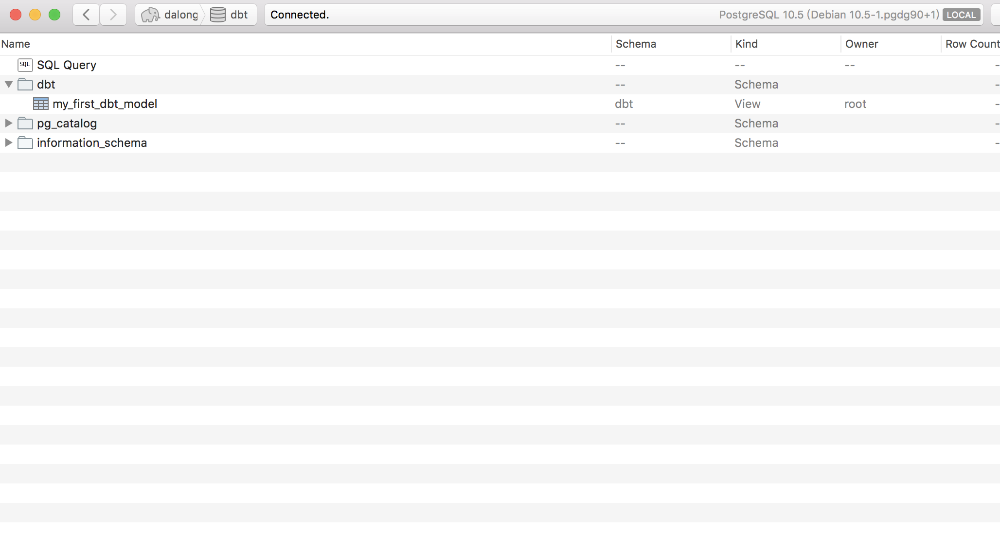

# dbt models for test

## How to Run

* install dbt

```code
pip install dbt
```

* init pg database(use docker)

```code
docker-compose up -d
```

* config profiles

```code
dbt debug --config-dir

contet:

default:
  target: dev
  outputs:
    dev:
      type: postgres
      host: 127.0.0.1
      user: root
      pass: password
      port: 5432
      dbname: dbt
      schema: dbt
      threads: 3
```

## some images

